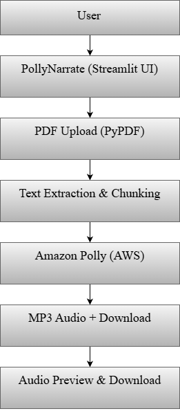
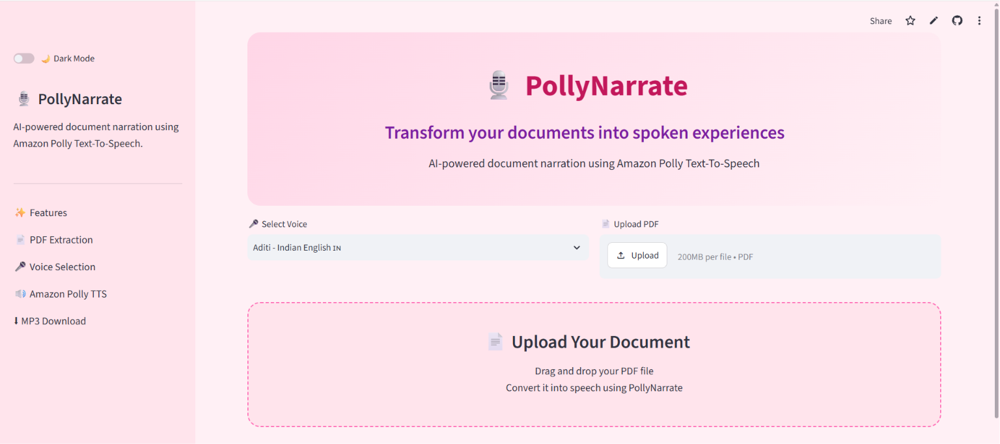
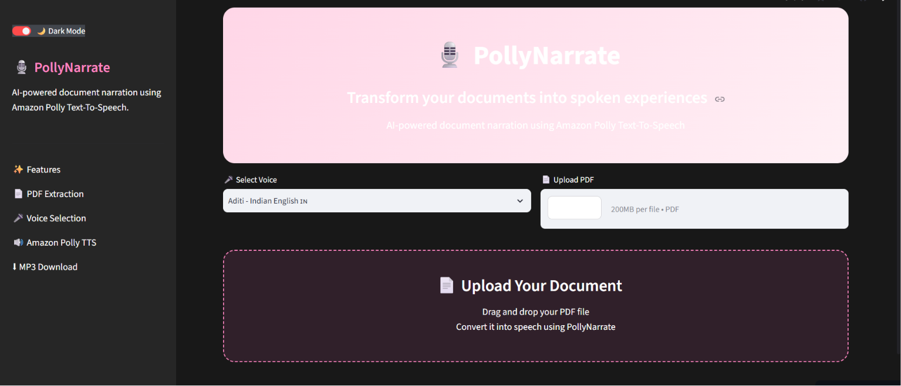
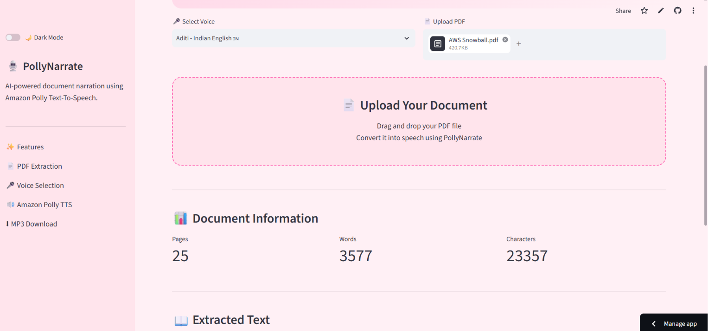
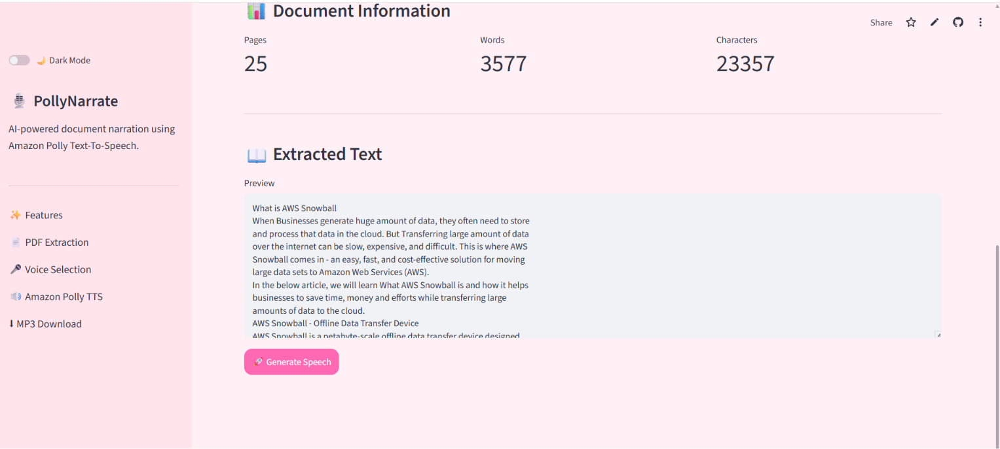
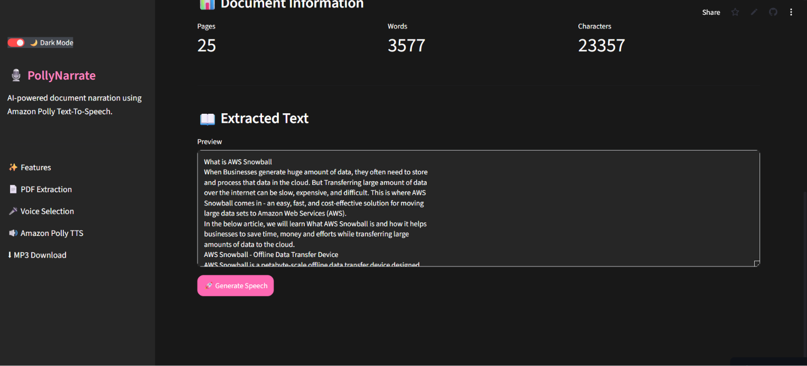
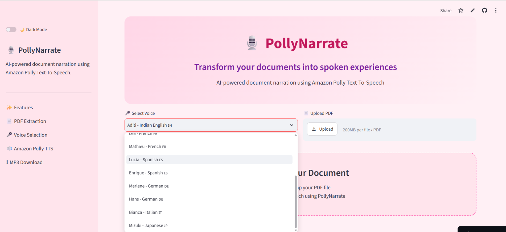
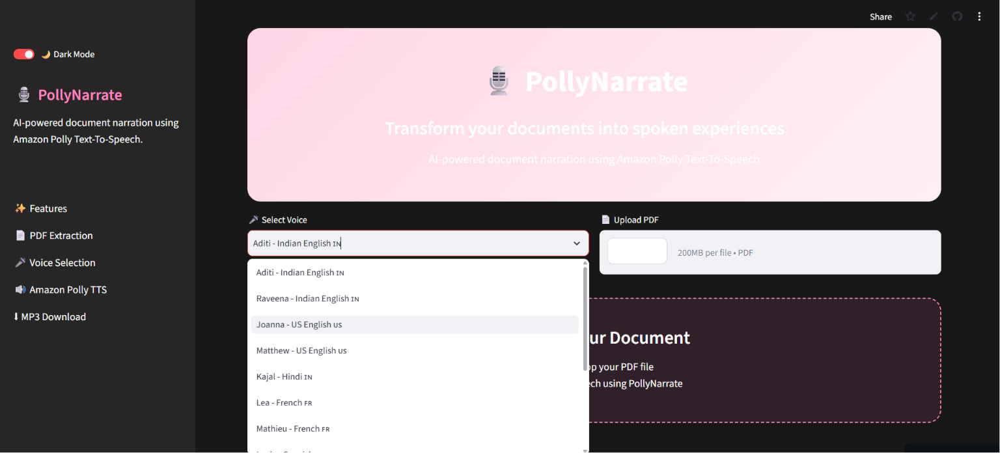
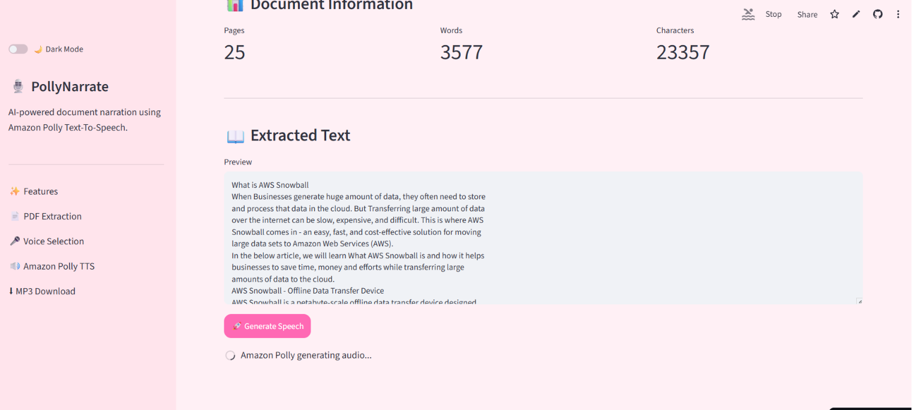
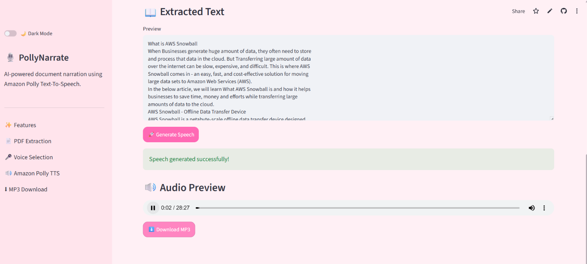

# 🎙️ PollyNarrate

AI-powered document narration system using Amazon Polly.

## Features
- Upload PDF documents
- Extract text from PDF
- Convert text into speech
- Multiple voice options
- Download MP3 audio

## Tech Stack
- Python
- Streamlit
- Amazon Polly
- Boto3
- PyPDF

## 🏗️ Architecture

## 📸 Screenshots

### Home Page
| Light Mode | Dark Mode |
|---|---|
|  |  |

### PDF Upload

### Extracted Text
| Light Mode | Dark Mode |
|---|---|
|  |  |

### Voice Selection
| Light Mode | Dark Mode |
|---|---|
|  |  |

### Generating Audio (Amazon Polly)

### Generated Audio / Speech Output

